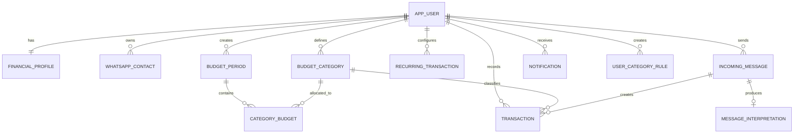
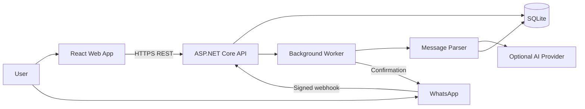
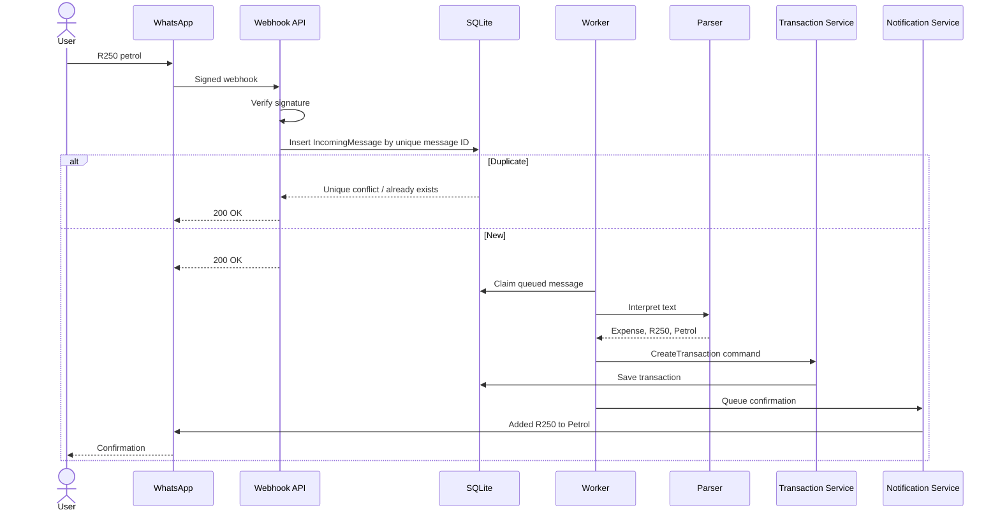

# Database and UML Specification

## Core tables

### AppUsers
- Id TEXT PK
- IdentityUserId TEXT UNIQUE NOT NULL
- DisplayName TEXT NOT NULL
- PreferredCurrency TEXT NOT NULL DEFAULT `ZAR`
- TimeZone TEXT NOT NULL DEFAULT `Africa/Johannesburg`
- PreferredLanguage TEXT NOT NULL DEFAULT `en-ZA`
- Status INTEGER NOT NULL
- CreatedUtc TEXT NOT NULL
- UpdatedUtc TEXT NOT NULL
- DeletedUtc TEXT NULL

### FinancialProfiles
- Id TEXT PK
- UserId TEXT UNIQUE FK
- DefaultMonthlyIncomeCents INTEGER NOT NULL
- PaydayDay INTEGER NULL
- BudgetCycleType INTEGER NOT NULL
- StartingBalanceCents INTEGER NOT NULL DEFAULT 0
- SafetyBufferCents INTEGER NOT NULL DEFAULT 0
- SavingsCommitmentCents INTEGER NOT NULL DEFAULT 0
- NotificationMode INTEGER NOT NULL
- FirstDayOfWeek INTEGER NOT NULL
- CreatedUtc TEXT NOT NULL
- UpdatedUtc TEXT NOT NULL

### BudgetPeriods
- Id TEXT PK
- UserId TEXT FK
- StartDate TEXT NOT NULL
- EndDate TEXT NOT NULL
- ExpectedIncomeCents INTEGER NOT NULL
- ActualIncomeCents INTEGER NOT NULL DEFAULT 0
- OpeningBalanceCents INTEGER NOT NULL DEFAULT 0
- Status INTEGER NOT NULL
- CreatedUtc TEXT NOT NULL
- UpdatedUtc TEXT NOT NULL

Unique: UserId + StartDate + EndDate

### BudgetCategories
- Id TEXT PK
- UserId TEXT NULL FK
- Name TEXT NOT NULL
- Slug TEXT NOT NULL
- CategoryType INTEGER NOT NULL
- Icon TEXT NULL
- SortOrder INTEGER NOT NULL
- IsSystem INTEGER NOT NULL
- IsActive INTEGER NOT NULL
- CreatedUtc TEXT NOT NULL
- UpdatedUtc TEXT NOT NULL

### CategoryBudgets
- Id TEXT PK
- BudgetPeriodId TEXT FK
- CategoryId TEXT FK
- AllocatedAmountCents INTEGER NOT NULL
- RolloverAmountCents INTEGER NOT NULL DEFAULT 0
- WarningThresholdPercent INTEGER NOT NULL DEFAULT 80
- CreatedUtc TEXT NOT NULL
- UpdatedUtc TEXT NOT NULL

Unique: BudgetPeriodId + CategoryId

### Transactions
- Id TEXT PK
- UserId TEXT FK
- CategoryId TEXT FK
- IncomingMessageId TEXT NULL FK
- RecurringTransactionId TEXT NULL FK
- AmountCents INTEGER NOT NULL
- TransactionType INTEGER NOT NULL
- Description TEXT NOT NULL
- Merchant TEXT NULL
- TransactionDate TEXT NOT NULL
- Source INTEGER NOT NULL
- Status INTEGER NOT NULL
- ConfidenceBasisPoints INTEGER NULL
- Notes TEXT NULL
- CreatedUtc TEXT NOT NULL
- UpdatedUtc TEXT NOT NULL
- DeletedUtc TEXT NULL

Indexes:
- UserId + TransactionDate
- UserId + CategoryId + TransactionDate
- IncomingMessageId

### RecurringTransactions
- Id TEXT PK
- UserId TEXT FK
- CategoryId TEXT FK
- Description TEXT NOT NULL
- Merchant TEXT NULL
- AmountCents INTEGER NOT NULL
- TransactionType INTEGER NOT NULL
- Frequency INTEGER NOT NULL
- DayOfMonth INTEGER NULL
- DayOfWeek INTEGER NULL
- NextOccurrenceDate TEXT NOT NULL
- EndDate TEXT NULL
- AutoCreate INTEGER NOT NULL
- IsActive INTEGER NOT NULL
- CreatedUtc TEXT NOT NULL
- UpdatedUtc TEXT NOT NULL

### WhatsAppContacts
- Id TEXT PK
- UserId TEXT FK
- PhoneNumberHash TEXT UNIQUE NOT NULL
- EncryptedPhoneNumber TEXT NOT NULL
- PlatformContactId TEXT NULL
- IsVerified INTEGER NOT NULL
- VerifiedUtc TEXT NULL
- CreatedUtc TEXT NOT NULL
- UpdatedUtc TEXT NOT NULL

### IncomingMessages
- Id TEXT PK
- UserId TEXT NULL FK
- WhatsAppMessageId TEXT UNIQUE NOT NULL
- PlatformContactId TEXT NOT NULL
- MessageType TEXT NOT NULL
- RawTextEncrypted TEXT NULL
- PayloadHash TEXT NOT NULL
- ProcessingStatus INTEGER NOT NULL
- FailureReason TEXT NULL
- AttemptCount INTEGER NOT NULL DEFAULT 0
- ReceivedUtc TEXT NOT NULL
- ProcessedUtc TEXT NULL

### MessageInterpretations
- Id TEXT PK
- IncomingMessageId TEXT UNIQUE FK
- Intent TEXT NOT NULL
- AmountCents INTEGER NULL
- TransactionType INTEGER NULL
- Description TEXT NULL
- Merchant TEXT NULL
- TransactionDate TEXT NULL
- SuggestedCategoryId TEXT NULL FK
- ConfidenceBasisPoints INTEGER NOT NULL
- ParserVersion TEXT NOT NULL
- RawStructuredResult TEXT NULL
- CreatedUtc TEXT NOT NULL

### UserCategoryRules
- Id TEXT PK
- UserId TEXT FK
- MatchType INTEGER NOT NULL
- MatchValue TEXT NOT NULL
- NormalizedMatchValue TEXT NOT NULL
- CategoryId TEXT FK
- Priority INTEGER NOT NULL
- IsActive INTEGER NOT NULL
- CreatedUtc TEXT NOT NULL
- UpdatedUtc TEXT NOT NULL

### Notifications
- Id TEXT PK
- UserId TEXT FK
- Channel INTEGER NOT NULL
- NotificationType INTEGER NOT NULL
- MessageEncrypted TEXT NOT NULL
- Status INTEGER NOT NULL
- ScheduledUtc TEXT NOT NULL
- SentUtc TEXT NULL
- FailureReason TEXT NULL
- AttemptCount INTEGER NOT NULL DEFAULT 0
- CreatedUtc TEXT NOT NULL

### AuditLogs
- Id TEXT PK
- UserId TEXT NULL
- EventType TEXT NOT NULL
- EntityType TEXT NULL
- EntityId TEXT NULL
- MetadataJson TEXT NULL
- IpAddressHash TEXT NULL
- CreatedUtc TEXT NOT NULL

## ER diagram

## System context

## WhatsApp sequence

